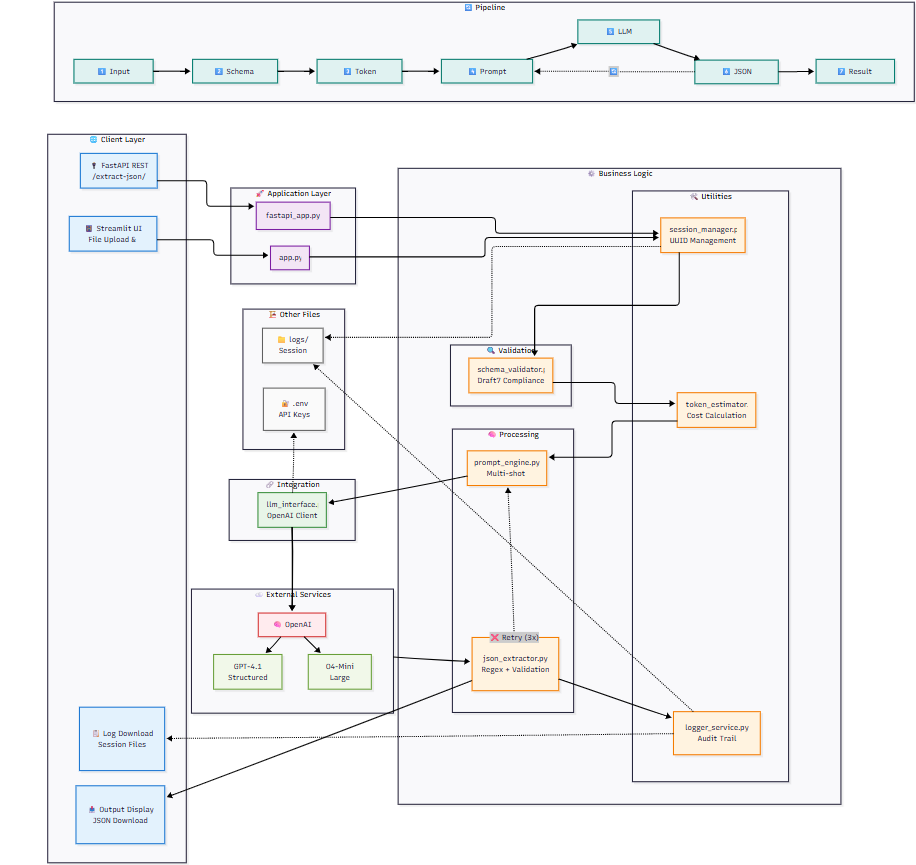
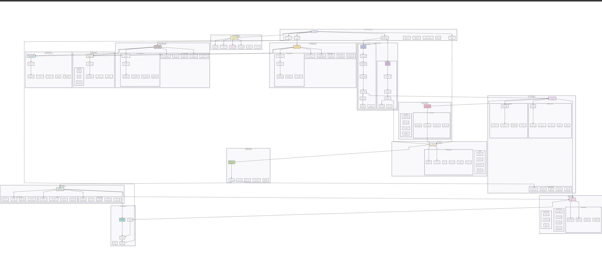

# 🧠 Advanced Structured JSON Extractor v2.0: Unstructured Text → Structured JSON

> Enterprise-grade document processing system that converts complex unstructured documents into valid structured JSON using state-of-the-art LLMs with intelligent chunking, schema partitioning, and multi-pass extraction.

---

## 🔗 App Access

**Streamlit App**: [https://json-extract-gen.streamlit.app/](https://json-extract-gen.streamlit.app/)

---

## 🚀 How to Use the App

### Quick Start (Simple Pipeline)
1. Visit the app link above.
2. Upload a valid JSON schema.
3. Upload a text file (`.txt` or `.pdf`) with unstructured content.
4. Choose your model from the dropdown:
   - 🧠 **GPT 4.1** (128K context) — Balanced performance & cost
   - 🚀 **O4 Mini** (128K context) — Cost-effective for large documents
   - 🎯 **Claude Sonnet 4.0** (200K context) — Best for complex schemas
   - 💬 **Chat GPT O3** (128K context) — Advanced reasoning
5. Review file analysis (tokens, nesting level, complexity score).
6. Select **Simple Pipeline** for documents < 10K tokens.
7. View extracted JSON with validation status.
8. Download the JSON output and session logs.

### Advanced Usage (Extensive Pipeline)
For large documents (>10K tokens) or complex schemas:

1. After file upload and analysis, select **Extensive Pipeline**.
2. **Step 1 - Text Analysis**:
   - Review semantic structure analysis
   - Approve/regenerate/skip intelligent chunking strategy
3. **Step 2 - Schema Analysis**:
   - Review schema complexity metrics
   - Approve/regenerate/skip schema partitioning
4. **Step 3 - Multi-Pass Extraction**:
   - Choose 2-5 extraction passes
   - System performs deep extraction with context awareness
5. **Step 4 - Intelligent Merging**:
   - Automatic merging of all extractions
   - Schema compliance enforcement
6. Download validated JSON and detailed logs.

---

## 🏗️ Architecture Overview

### Two Processing Pipelines

#### ⚡ Simple Pipeline
- Direct extraction for small documents
- Single-pass processing with 3 retry attempts
- Best for: Documents < 10K tokens, simple schemas

#### 🚀 Extensive Pipeline
- **Intelligent Text Chunking**: Semantic-aware document splitting
- **Schema Partitioning**: Break complex schemas into manageable parts
- **Multi-Pass Extraction**: 2-5 passes with increasing depth
- **Context-Aware Processing**: Embeddings maintain document coherence
- **Intelligent Merging**: Programmatic conflict resolution
- Best for: Large documents, complex nested schemas, high accuracy requirements

---

## 🧱 System Architecture

### High-Level Components


### Detailed Components



### Core Modules

| Module | Purpose |
|--------|---------|
| **Text Analyzer** | Semantic structure discovery, intelligent chunking |
| **Schema Analyzer** | Complexity calculation, partitioning strategy |
| **Extraction Engine** | Multi-pass extraction with validation |
| **Merger Engine** | Intelligent merging with schema compliance |
| **Embedding Manager** | Context preservation across chunks |
| **Token Estimator** | Smart token management & truncation |
| **Session Manager** | State tracking & persistence |

---

## 🧰 Technologies Used

- **LLM APIs**: OpenAI GPT-4.1, O4 Mini, O3 + Anthropic Claude Sonnet 4.0
- **Frontend**: Streamlit with real-time progress tracking
- **Embeddings**: Sentence-Transformers (384-dim vectors)
- **Validation**: JSON Schema Draft 7 + jsonschema
- **Token Management**: tiktoken with model-specific limits
- **Prompting**: Adaptive multi-pass with few-shot learning
- **Logging**: Thread-safe, structured session logs
- **Processing**: Concurrent chunk/partition processing

---

## 📁 Project Structure

```text
JSON-EXTRACTOR-V2/
├── core/                         # Core processing modules
│   ├── __init__.py
│   ├── extraction_engine.py     # Multi-pass extraction logic
│   ├── merger_engine.py         # Intelligent merging system
│   ├── text_analyzer.py         # Semantic text analysis
│   ├── schema_analyzer.py       # Schema complexity analysis
│   ├── embedding_manager.py     # Vector embeddings & similarity
│   ├── json_extractor.py        # JSON extraction & validation
│   ├── llm_interface.py         # Multi-model LLM interface
│   ├── logger_service.py        # Comprehensive logging
│   ├── prompt_engine.py         # Adaptive prompt generation
│   ├── session_manager.py       # Session state management
│   └── token_estimator.py       # Advanced token management
│
├── logs/                         # Session logs & outputs
│   └── [session-id]/
│       ├── metadata.json
│       ├── session.log
│       └── output.json
│
├── embeddings_cache/             # Cached embeddings
│
├── Sample Inputs/                # Test cases & examples
│
├── .env                          # API keys (OPENAI_API_KEY, ANTHROPIC_API_KEY)
├── .gitignore
├── app.py                        # Streamlit application
├── requirements.txt
└── README.md
```

---

## 🔧 Local Setup

```bash
# Clone repository
git clone https://github.com/[your-repo]/json-extractor-v2.git
cd json-extractor-v2

# Install dependencies
pip install -r requirements.txt

# Configure API keys
echo "OPENAI_API_KEY=sk-..." > .env
echo "ANTHROPIC_API_KEY=sk-ant-..." >> .env

# Run Streamlit app
streamlit run app.py
```

---

## 📊 Key Features

### 🎯 Intelligent Processing
- **Semantic Analysis**: Understands document structure and information density
- **Adaptive Chunking**: Respects natural boundaries (paragraphs, sections)
- **Schema Partitioning**: Handles schemas with 100+ fields efficiently
- **Multi-Pass Extraction**: Progressive refinement for accuracy

### 🔒 Reliability
- **Schema Validation**: Strict Draft 7 compliance
- **Type Coercion**: Automatic type fixing
- **Error Recovery**: Programmatic and LLM-based fixing
- **Token Safety**: Never truncates critical schema information

### 📈 Performance
- **Optimized Mode**: Skip merging for single chunk/partition
- **Parallel Processing**: Concurrent chunk-partition extraction
- **Smart Caching**: Embedding reuse across sessions
- **Token Efficiency**: Intelligent prompt optimization

### 📝 Observability
- **Real-Time Progress**: Live updates during processing
- **Detailed Metrics**: Tokens, complexity, field counts
- **Comprehensive Logs**: Every step logged with timestamps
- **Export Options**: JSON, TXT, CSV log formats

---

## 💡 Usage Tips

1. **Model Selection**:
   - Use Claude Sonnet 4.0 for complex nested schemas
   - GPT-4.1 for balanced performance
   - O4 Mini for cost-effective large document processing

2. **Pipeline Selection**:
   - Simple: Documents < 10K tokens, straightforward schemas
   - Extensive: Large documents, complex schemas, critical accuracy

3. **Optimization**:
   - Approve chunking for documents > 5K tokens
   - Partition schemas with > 50 fields
   - Use 3-pass extraction for optimal accuracy

4. **Troubleshooting**:
   - Check logs for token limit issues
   - Ensure schema is Draft 7 compliant
   - Verify API keys are correctly configured

---

## 📚 Documentation

🧾 View detailed documentation [click here](https://docs.google.com/document/d/e/2PACX-1vR-vEbZA1sojVCf9MwVLlU0KaYF_In8wGCkgnSmUXlcDM7GSDSKnjx_3lQi99mMnx8RTdrg8O6LKEW3/pub).

---

## 🚀 What's New in v2.0

- ✨ **Extensive Pipeline**: Advanced processing for complex documents
- 🧩 **Schema Partitioning**: Handle schemas with 500+ fields
- 🔄 **Multi-Pass Extraction**: 5-pass deep extraction system
- 🧠 **Embedding Integration**: Semantic context preservation
- 🤖 **Claude Support**: Added Anthropic Claude Sonnet 4.0
- 📊 **Advanced Analytics**: Complexity scoring & metrics
- 🔧 **Smart Merging**: Programmatic conflict resolution
- 📈 **100K+ Token Support**: Process entire books/reports

---

## 👤 Author & Support

Developed by **Avijeet Palit**  
📫 Contact: [avijeet.palit07@gmail.com]  
🐛 Issues: [GitHub Issues](https://github.com/[your-repo]/issues)  
💬 Discussions: [GitHub Discussions](https://github.com/[your-repo]/discussions)